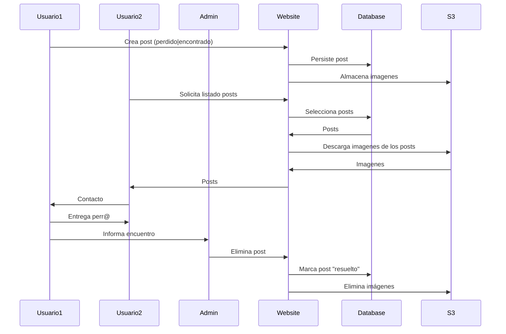

# FLUJOS

```mermaid
sequenceDiagram
    participant U1 as Usuario1
    participant U2 as Usuario2
    participant A as Admin
    participant W as Website
    participant DB as Database
    participant S3 as S3

    U1->>W: Crea post (perdido|encontrado)
    W->>DB: Persiste post
    W->>S3: Almacena imagenes
    U2->>W: Solicita listado posts
    W->>DB: Selecciona posts
    DB->>W: Posts
    W->>S3: Descarga imagenes de los posts
    S3->>W: Imagenes
    W->>U2: Posts
    U2->>U1: Contacto
    U1->>U2: Entrega perr@
    U1->>A: Informa encuentro
    A->>W: Elimina post
    W->>DB: Marca post "resuelto"
    W->>S3: Elimina imágenes
```

